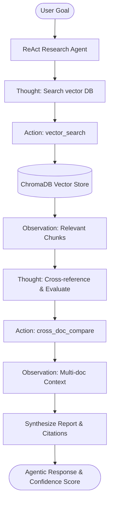

# AI Research Assistant & Autonomous Agentic Platform

An production-grade **Agentic RAG & Research Assistant Platform** built with **FastAPI**, **ChromaDB**, **React 18 + Vite**, and **Autonomous ReAct Agents**. Upload technical papers or research documents, execute multi-step agentic research loops, inspect explicit prompt engineering templates, run comprehensive unit tests, and perform multi-document comparative reasoning.

---

## 🌟 Key Highlights & Architectural Features

### 1. 🤖 Autonomous ReAct Research Agent (`backend/app/services/agent.py`)
- **Reasoning + Acting Loop**: Given a research goal, the autonomous agent executes a multi-step decision cycle using tools: `vector_search`, `document_summarizer`, `cross_doc_compare`, and `evaluate_sufficiency`.
- **Transparent Execution Trace**: Returns step-by-step reasoning steps (`thought_steps`), tool inputs/outputs, confidence scores, and chunk citations.



### 2. 📝 Explicit Prompt Engineering Module (`backend/app/prompts/`)
All prompt templates are versioned, explicitly structured, and isolated into dedicated python modules:
- `qa_prompt.py` (v1.2.0): Few-shot QA prompt with strict citation constraints `[Chunk N]` and fallback handles.
- `agent_prompt.py` (v2.0.0): ReAct loop prompt defining tool schema, reasoning structure, and stop conditions.
- `summary_prompt.py` (v1.1.0): Multi-style document summarization prompt (bullet, paragraph, executive).
- `quiz_prompt.py` (v1.0.0): Structured JSON output prompt for generating multiple-choice quizzes.

### 3. ⚡ Embedding Model Flexibility (`backend/app/services/documents.py`)
- **Local Zero-Dependency Default**: Uses `sentence-transformers` (`all-MiniLM-L6-v2`) via ChromaDB for instant offline execution without external API dependencies.
- **OpenAI High-Dimensional Fallback**: Easily toggle to OpenAI `text-embedding-3-small` via `.env` (`EMBEDDING_PROVIDER=openai`).

### 4. 🧪 Software Engineering & Pytest Test Suite (`backend/tests/`)
Comprehensive test suite validating chunking, prompt rendering, RAG retrieval, agent ReAct loops, and FastAPI endpoints.

```bash
# Run pytest test suite
cd backend
python -m pytest tests -v
```

---

## 🚀 Quickstart

### Prerequisites
- Python 3.10+
- Node.js 18+

### 1. Backend Setup

```bash
cd backend
python -m venv .venv

# On Windows:
.venv\Scripts\Activate.ps1
# On macOS/Linux:
source .venv/bin/activate

pip install -r requirements.txt
cp .env.example .env

# Run FastAPI server
uvicorn app.main:app --reload
```

Backend will start at `http://127.0.0.1:8000`. API Docs available at `http://127.0.0.1:8000/docs`.

### 2. Frontend Setup

```bash
cd frontend
npm install
npm run dev
```

Open application at `http://localhost:5173`.

---

## 📁 Repository Structure

```
AI-Research-Assistant/
├── backend/
│   ├── app/
│   │   ├── api/
│   │   │   └── routes.py           # FastAPI routes (/api/ask, /api/agent/research, /api/upload)
│   │   ├── core/
│   │   │   └── config.py           # Provider configs, CORS, paths
│   │   ├── models/
│   │   │   └── schemas.py          # Pydantic schemas (AgentResearchResponse, AskResponse, etc.)
│   │   ├── prompts/                # Explicit Prompt Engineering templates
│   │   │   ├── agent_prompt.py
│   │   │   ├── qa_prompt.py
│   │   │   ├── summary_prompt.py
│   │   │   └── quiz_prompt.py
│   │   └── services/
│   │       ├── agent.py            # ReAct Research Agent implementation
│   │       ├── documents.py        # ChromaDB vector store & PDF extraction
│   │       └── rag.py              # Retrieval-Augmented Generation engine
│   └── tests/                      # Pytest suite
│       ├── test_agent.py
│       ├── test_api.py
│       ├── test_chunking.py
│       ├── test_prompts.py
│       └── test_rag.py
└── frontend/
    └── src/
        ├── components/
        ├── pages/
        │   ├── AgentPage.jsx       # Autonomous ReAct Agent UI & Thought Stream
        │   ├── ChatPage.jsx        # Document QA with Chunk Citations & Confidence
        │   ├── ComparePage.jsx     # Multi-document cross comparison
        │   ├── QuizPage.jsx
        │   └── SummaryPage.jsx
        └── services/
            └── api.js              # Axios API service bindings
```

---

## 🔌 API Endpoints Reference

| Endpoint | Method | Description |
|---|---|---|
| `/api/health` | `GET` | Health status, active embedding provider, & agent status |
| `/api/documents` | `GET` | List uploaded PDFs and metadata |
| `/api/upload` | `POST` | Upload PDF file and chunk into ChromaDB vector store |
| `/api/agent/research` | `POST` | **Autonomous ReAct Agent research query execution** |
| `/api/ask` | `POST` | Grounded QA query with citation previews & confidence score |
| `/api/summarize` | `POST` | Generate document summary (bullet, paragraph, executive) |
| `/api/quiz` | `POST` | Generate multiple-choice quiz items |
| `/api/compare` | `POST` | Cross-document topics and comparative analysis |

---

## 📄 License

MIT License. Free for research and educational use.